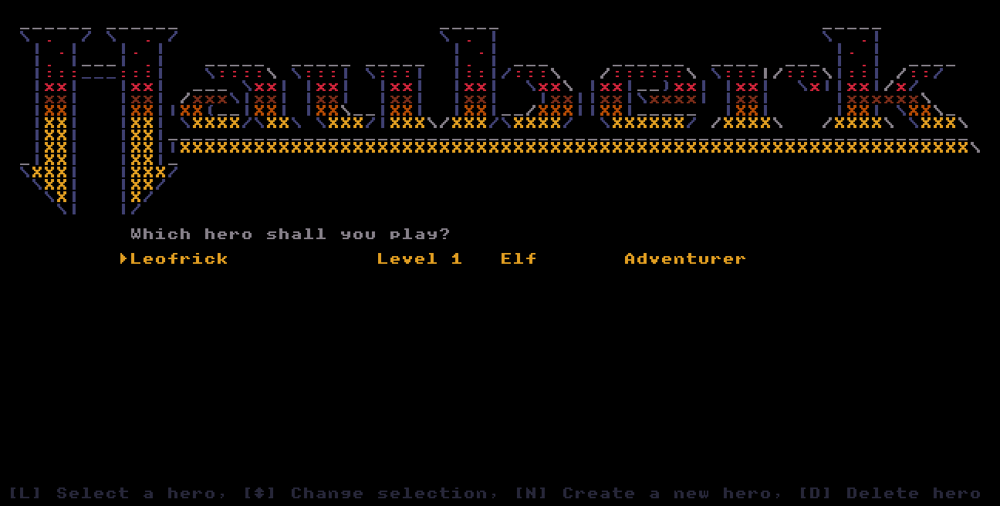

[](https://github.com/gongahkia/jomon/releases/tag/1.0.0)


# `Jomon`

Browser-based, turn-based courier roguelike. Carry a sealed parcel through a deterministic four-region, sixteen-floor campaign while managing fog of war, equipment, routes, hazards, and succession.

## Stack

* Language: [TypeScript](https://www.typescriptlang.org/)
* Runtime: browser [Canvas 2D API](https://developer.mozilla.org/docs/Web/API/CanvasRenderingContext2D) and Web Audio
* Tooling: [Vite](https://vite.dev/)
* Tests: [Vitest](https://vitest.dev/)
* Assets/Fonts: [BigBlue Terminal](https://int10h.org/blog/2015/12/bigblue-terminal-oldschool-fixed-width-font/)

## Screenshots

<p align="center">
  
  
  
</p>

## Usage

The below commands run `Jomon` locally.

```sh
git clone https://github.com/gongahkia/jomon && cd jomon
npm ci
npm run dev
```

Build a production bundle:

```sh
npm run build
npm run preview
```

## Controls

| Key | Action |
| --- | --- |
| `I` `O` `P` / `K` `;` / `,` `.` `/` or numpad | Move in eight directions |
| `L` | Wait / rest |
| `Shift` + move | Run |
| `Alt` + direction | Quick cast |
| `G` `U` `D` `E` `T` | Get, use, drop, equip, throw |
| `A` `S` `B` `R` | Skills, charm, bomb, rope |
| `C` `Q` `X` | Operate, descend, swap |
| `H` `J` `F1` | Help, journal, settings |
| `V` | Cycle ASCII, sprites, and runes |
| `F` / `Shift` + `F` | Toggle autoplay / change autoplay policy |
| `+` `-` `0` or mouse wheel | Change / reset board zoom |
| `Esc` or backtick | Pause or cancel |

Menu controls: `N` creates a courier, `L`/`Enter` resumes one, arrows select, and `D` retires one. Key bindings can be changed in settings.

## Reference

`Jomon` is thoroughly inspired by [Bob Nystrom](https://x.com/munificentbob?lang=en) *(a.k.a [@munifcent](https://github.com/munificent))*'s [Hauberk](https://github.com/munificent/hauberk).

<div align="center">
    
</div>
