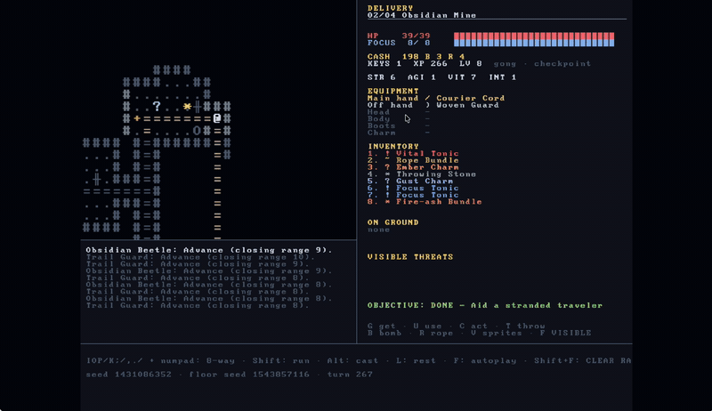
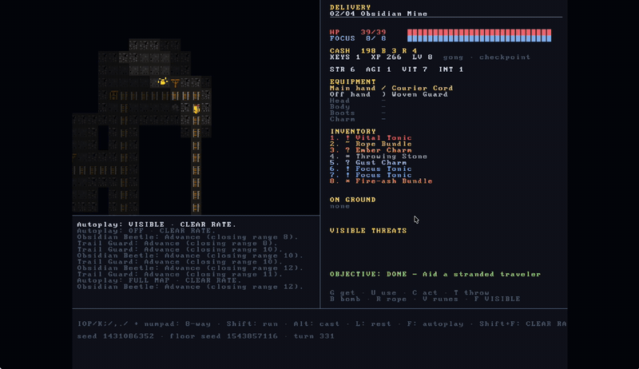
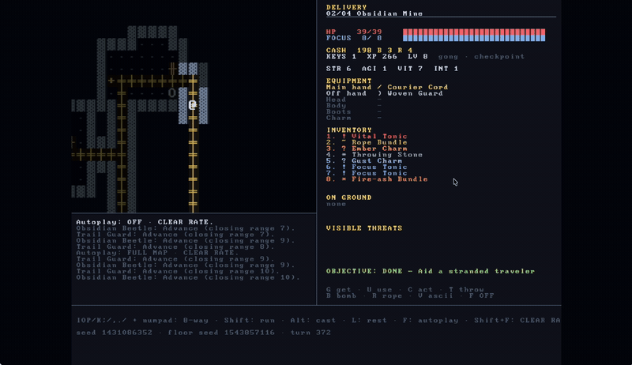

[](https://github.com/gongahkia/jomon/releases/tag/1.0.0)


# `Jomon`

Browser-based, turn-based courier roguelike. Carry a sealed parcel through a deterministic four-region, sixteen-floor campaign while managing fog of war, equipment, routes, hazards, and succession.

## Stack

* Language: [TypeScript](https://www.typescriptlang.org/)
* Runtime: browser [Canvas 2D API](https://developer.mozilla.org/docs/Web/API/CanvasRenderingContext2D) and Web Audio
* Tooling: [Vite](https://vite.dev/)
* Tests: [Vitest](https://vitest.dev/)

## Assets

* Font: `BigBlueTerm437NerdFontMono-Regular.ttf`
* Renderers: ASCII, sprite atlas, and rune glyph modes
* Reference captures: [`asset/reference`](asset/reference)

## Screenshots

<p align="center">
  
  
  
</p>

## Usage

The below commands run Jomon locally.

```sh
git clone https://github.com/gongahkia/jomon && cd jomon
npm ci
npm run dev
```

Build a production bundle:

```sh
npm run build
npm run preview
```

## Controls

| Key | Action |
| --- | --- |
| `I` `O` `P` / `K` `;` / `,` `.` `/` or numpad | Move in eight directions |
| `L` | Wait / rest |
| `Shift` + move | Run |
| `Alt` + direction | Quick cast |
| `G` `U` `D` `E` `T` | Get, use, drop, equip, throw |
| `A` `S` `B` `R` | Skills, charm, bomb, rope |
| `C` `Q` `X` | Operate, descend, swap |
| `H` `J` `F1` | Help, journal, settings |
| `V` | Cycle ASCII, sprites, and runes |
| `F` / `Shift` + `F` | Toggle autoplay / change autoplay policy |
| `+` `-` `0` or mouse wheel | Change / reset board zoom |
| `Esc` or backtick | Pause or cancel |

Menu controls: `N` creates a courier, `L`/`Enter` resumes one, arrows select, and `D` retires one. Key bindings can be changed in settings.

## Validation

```sh
npm test
npm run test:ci
npm run test:e2e
npm run smoke:autoplay
npm run autoplay:headless
npm run autoplay:benchmark
npm run autoplay:diagnose
REPORT_ISSUE=0 OUT_DIR=clearance/seed-sweep-0-9 SEED_COUNT=10 START_SEED=0 TURNS=3200 RETRY_LIMIT=1 MIN_RATE=1 npm run clearance:local
```

`npm run test:ci` requires one-minute system load below available CPUs, uses one worker, and runs each full-campaign autoplay regression in its own Vitest invocation. The individual 60-second test budgets remain strict; saturation fails fast and campaign runs cannot trigger aggregate reporter RPC timeouts.

This bounded closure gate validates every seed from 0 through 9 inclusive; it does not establish 100- or 1,000-seed clearance. It is local-only and does not create GitHub issues. It checkpoints every completed seed; rerun the exact command to resume. `kill -INT <supervisor-pid>` or `kill -TERM <supervisor-pid>` stops the active seed worker and writes an interrupted report. Resume requires the same commit, worktree patch, and run parameters; otherwise use a new `OUT_DIR`.

## Nerd stuff

### Campaign

Each seed deterministically generates four floors in each region: Obsidian Mine, Cedar Wilds, Sea Caves, and Stone Circle. Courier records, checkpoints, campaign state, and local run analyses persist in IndexedDB.

### Rendering

The game renders a fixed terminal grid through Canvas 2D. The same simulation supports text glyphs, a generated sprite atlas, and rune tiles; fog of war, telegraphs, effects, and message history are shared across modes.

### Autoplay

Autoplay has visible-map and full-map modes, with survival, clear-rate, and legacy policies. Its headless runner records turn traces, detects stalled states, and is available for local clearance checks.

## Reference

`Jomon` is thoroughly inspired by [Bob Nystrom](https://x.com/munificentbob?lang=en) *(a.k.a [@munifcent](https://github.com/munificent))*'s [Hauberk](https://github.com/munificent/hauberk).
