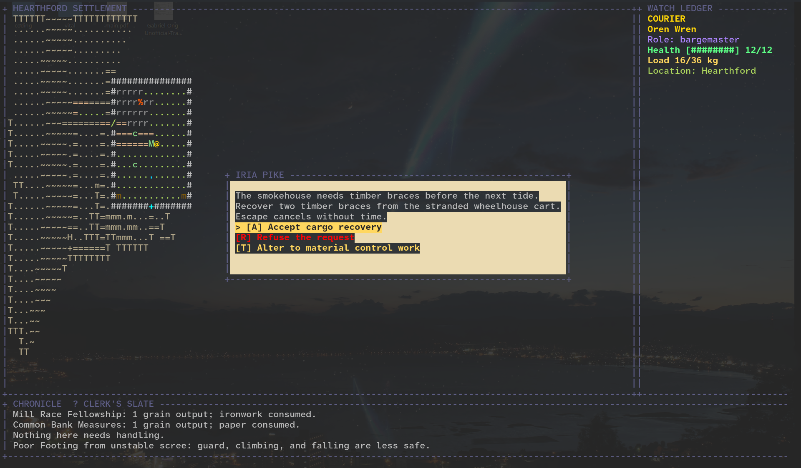
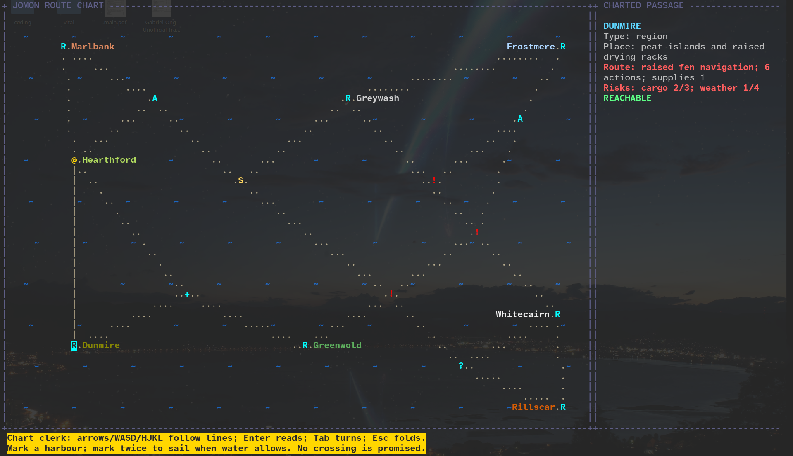

# `Jomon` 🛖

A [persistent](https://cavesofqud.com/) roguelike where you're a [late-medival mailman](https://en.wikipedia.org/wiki/Jōmon_people), played entirely in the [CLI](https://dwarffortresswiki.org/index.php/Command_line).

## Stack

* [Python 3.11](https://www.python.org/) *(but newer is fine)*
* [curses](https://docs.python.org/3/library/curses.html)

## Screenshots

<div align="center">
    
    
</div>

## Usage

> [!NOTE]  
> `Jomon` minimally requires a 80-column by 24-row terminal.

The below instructions are for locally running `Jomon`.

1. First clone the repository.

```console
$ git clone https://github.com/gongahkia/jomon && cd jomon
```

2. Then run the below from repo root.

```console
$ python -m jomon
```

3. Optionally run the below commands for verification.

```console
$ python -m jomon.checks fast
$ python -m unittest discover -s tests -v
$ python -m compileall -q jomon tests
$ python -m jomon.verification content
$ git diff --check
```

## Controls

| Key | Action |
| --- | --- |
| arrows or `HJKL`; `YUBN` | Move cardinally or diagonally |
| `E` or Enter | Interact with the nearby world |
| `A` / `G` | Attack or choose a target / guard, brace, reload, or listen |
| `T` / `R` | Follow a known regional route / retreat |
| `I` / `F` / `X` | Open the pack / inspect materials / use a preparation or relic |
| `V` / `M` | Offer terms / open combat mastery |
| `P` / `D` / `W` | Skill tree / spellbook and shrine vigil / crafting and flasks |
| `\\` / `Z` | Circuit work / regional ledger |
| `C` / `O` / `;` | Character sheet / observe visible life / inspect without spending time |
| Tab | Choose the tug at Jomon's gangplank or open a vehicle interior |
| `?` / `S` / `Q` / Escape | Help / save aboard Jomon / quit / close or cancel |

## Reference

`Jomon` is thoroughly inspired by [Bob Nystrom](https://github.com/munificent)'s [Hauberk](https://github.com/munificent/hauberk).


