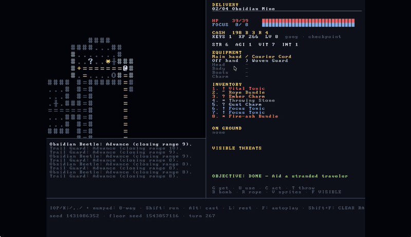
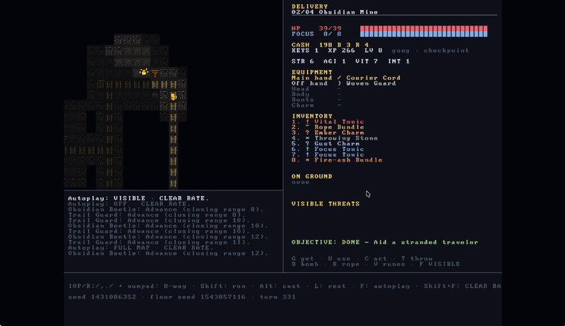
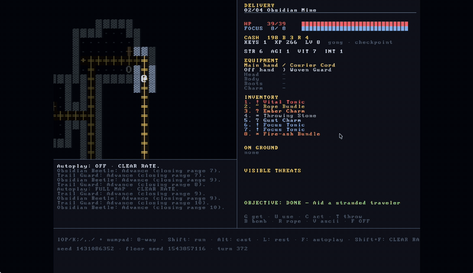
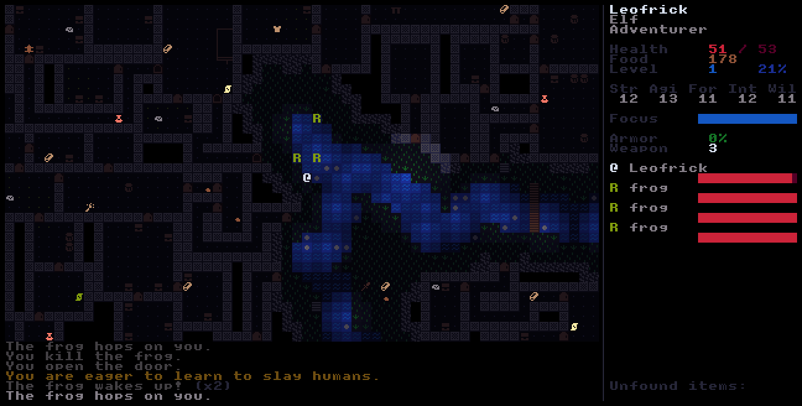

[](https://github.com/gongahkia/jomon/releases/tag/1.0.0)


# `Jomon`

Browser-based, turn-based courier roguelike. Every seed draws and orders four distinct biomes from an eight-biome pool for a sixteen-floor campaign; cleared floors increase shared threat regardless of biome identity.

## Stack

* Language: [TypeScript](https://www.typescriptlang.org/)
* Runtime: browser [Canvas 2D API](https://developer.mozilla.org/docs/Web/API/CanvasRenderingContext2D) and Web Audio
* Tooling: [Vite](https://vite.dev/)
* Tests: [Vitest](https://vitest.dev/)
* Assets/Fonts: [BigBlue Terminal](https://int10h.org/blog/2015/12/bigblue-terminal-oldschool-fixed-width-font/)

## Screenshots

<p align="center">
  
  
  
</p>

## Usage

The below commands run `Jomon` locally.

```sh
git clone https://github.com/gongahkia/jomon && cd jomon
npm ci
npm run dev
```

Audit deterministic level generation for all ten biomes:

```sh
npm run debug:levels
```

Build a production bundle:

```sh
npm run build
npm run preview
```

Generate deterministic spatial metrics; JSON reports default to ignored `generation-reports/`:

```sh
npm run generation:report
```

## Autoplay corpus

`src/autoplay-seed-corpus.json` contains fixed 48-seed development and held-out campaign partitions. Tune profiles only with `npm run autoplay:campaign:development`; use `npm run autoplay:campaign:held-out` solely for frozen evaluation. Held-out runs cannot update the campaign baseline.

CI reruns the full development corpus against `scripts/autoplay-campaign-baseline.json`. The frozen artifact records engine, corpus, objective, policy-profile, heuristic-profile versions, reviewer identity, and all per-seed objective tuples. A candidate fails on any lexicographically worse tuple (`clears`, `deaths`, `stalls`, `exploration`, `resource efficiency`); wall-time is diagnostic-only and has no objective tolerance. Ordinary tests and campaign runs never write the artifact. After manually reviewing the JSON tuple diff, update it only with `npm run autoplay:baseline:update -- --reviewed-by <identity> --review <reason>`. The command requires the compatibility heuristic profile and writes a new artifact only after the complete development matrix finishes.

Campaign JSON includes a deterministic `current.scoreboard` with per-seed rows and profile, policy, and information-mode aggregates. Each run's `evaluation` reports resource spend, retained reserves, `resourceOutcomes` (selected, deferred, rejected, projected route gains, critical-route selections), and separate `optionalOutcomes` (pursued, deferred, declined, secrets, shortcuts). Render a saved report with `npm run autoplay:scoreboard -- REPORT.json`; add `--json` for the standalone scoreboard. Missing or incomplete rows remain visible, and a winner is emitted only when the AP-01 comparator has a non-tied, fully observed profile matrix.

Autoplay evaluates ritual-tool cooldown, target legality, route/survival effect, and overdrive retirement before issuing `Y`; traces and headless reports retain the selected/deferred/rejected rationale plus tool uses and retirements. `EXPLORE` also scores side secrets and same-biome shortcuts by visible payoff, threat, route cost, resource cost, escape route, and remaining objective; visible mode requires observed payoff/risk evidence, while omniscient assessments are labelled diagnostics.

Autoplay heuristic profiles are versioned, named configurations. `compatibility` is the default and retains existing behavior; `conservative` raises resource and irreversible-action reserves. Select one with `HEURISTIC_PROFILE=conservative` before `autoplay:headless`, `autoplay:campaign`, `autoplay:benchmark`, `autoplay:coverage`, or `autoplay:diagnose`; invalid names or out-of-range profile data fail fast.

Visible policy features contain only current FOV, explored terrain, visible entities/items, courier kit, and the latest eight action/outcome entries; omniscient diagnostic features use the same typed schema with full-map visibility.

Replay a captured trace with `npm run autoplay:replay -- TRACE.json`; traces record resource decisions, projected deltas, and rejected alternatives. Divergence exits non-zero and reports its turn, field, expected value, actual value, and command.

Every non-clear campaign episode includes `failure.code` (`stall`, `death`, `illegal-action`, `hidden-route-miss`, `resource-waste`, `timeout`, or `replay-divergence`) and `failure.diagnosis`: evidence, the replay/partition/seed/profile/heuristic/turn-limit reproduction tuple, final decisions, and resource/traversal context. Reproduce a corpus seed with `npm run autoplay:campaign -- --partition <partition> --seed <seed>`. Tune only on `npm run autoplay:campaign:development`, inspect each failure diagnosis, then run `npm run autoplay:campaign:held-out` for human review; do not promote or update a baseline from held-out output.

Export AP-03 policy traces as stable, versioned JSONL with `npm run autoplay:dataset:development -- --output <path>` or `npm run autoplay:dataset:held-out -- --output <path>`. Add `--seed <seed>` to audit one corpus seed. Records expose decision-time observation, bounded history, legal actions, chosen action, transition/resource reward components, terminal outcome, and field provenance. Visible records omit replay/layout/route metadata and hidden-map fields; the exporter has no Python or ML dependency.

Runtime inference remains disabled by default. `src/autoplay-inference.ts` accepts only held-out-promoted visible-policy artifacts, masks outputs to the heuristic's legal candidates, records shadow disagreements, and deterministically retains the compatibility heuristic on disabled, missing, malformed, or illegal inference.

## Controls

| Key | Action |
| --- | --- |
| `I` `O` `P` / `K` `;` / `,` `.` `/` or numpad | Move in eight directions |
| `L` | Wait / rest |
| `Shift` + move | Run |
| `Alt` + direction | Quick cast |
| `G` `U` `D` `E` `T` | Get, use, drop, equip, throw |
| `A` `S` `B` `R` | Skills, charm, bomb, rope |
| `C` `Q` `X` | Operate, descend, swap |
| `Y` / `W` | Choose ritual tool / spend Time Knot rewind |
| `H` `J` `F1` | Help, journal, settings |
| `V` | Cycle ASCII and runes |
| `F` / `Shift` + `F` | Toggle autoplay / change autoplay policy |
| `+` `-` `0` or mouse wheel | Change / reset board zoom |
| `Esc` or backtick | Pause or cancel |

Menu controls: `N` creates a courier, `L`/`Enter` resumes one, arrows select, and `D` retires one. Key bindings can be changed in settings.

## Buildcraft

Every floor places one Waycache and three Boon sites. Waycaches bind two ritual tools: Stone Wedge, Reedwing, Cord Anchor, or Ashway Rites. Tools recharge by turn cooldown and can be explicitly overdriven for a stronger final effect before retiring. Boon sites offer deterministic three-way, run-only drafts; Boons stack without a cap. Powerful Boons can suppress conflicting trigger families instead of adding generic penalties. Cliffs add reusable vertical rope links; Burial adds oath, body, and cursed-object risk/reward engines. Local discovery is default; Scout Eye reveals all remaining milestones. `Shift` + `F` includes an `EXPLORE` autoplay policy that pursues discovered milestones before exit.

## Generated sprite atlas

Generated PNG sheets are intentionally absent. The manifest, atlas renderer, inspector, normalizer, and validator remain so sprite rendering can be restored without rebuilding gameplay mappings. Until then, `V` offers ASCII and runes only; the atlas inspector shows metadata instead of pixels.

To restore sprites, generate every runtime sheet named by `src/assets/generated-sprites/sprite-manifest.json` as a 16-pixel cell grid with the manifest's columns and rows. Use `scripts/normalize-sprite-sheet.py INPUT OUTPUT --columns N --rows N` to normalize source art. Restore the matching static Vite URLs in `src/sprites.ts`, restore `sprites` in `src/visual-mode.ts`, then run:

```sh
node scripts/validate-generated-sprites.mjs
npm test
npm run build
npm run test:e2e
```

## Reference

`Jomon` is thoroughly inspired by [Bob Nystrom](https://x.com/munificentbob?lang=en) *(a.k.a [@munifcent](https://github.com/munificent))*'s [Hauberk](https://github.com/munificent/hauberk).

<div align="center">
    
</div>
